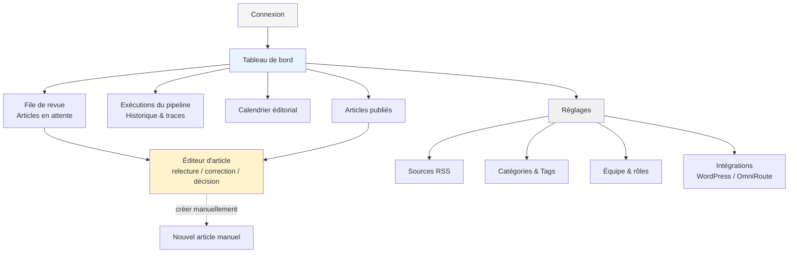
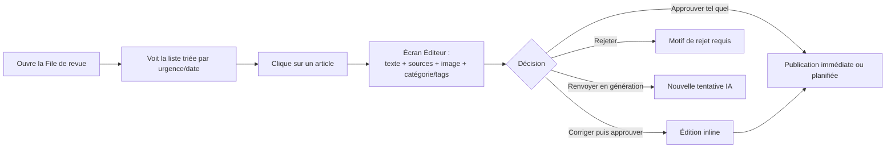

# Afrotiative Media — Plateforme interne de gestion de contenu
## Document d'analyse UI/UX — Brief pour prototypage

**Statut :** Prêt pour transmission à Claude Design
**Portée de ce document :** l'outil interne (dashboard/back-office) de gestion de contenu — pas le site public afrotiative.com, qui fait l'objet d'un document de marque et d'UI/UX séparé.

---

## 1. Contexte produit (résumé)

Afrotiative Media est un média panafricain business & finance, francophone en priorité. L'équipe automatise aujourd'hui la veille et la rédaction (RSS → extraction → IA → WordPress) et souhaite remplacer cette automatisation externe par **son propre logiciel interne** : une plateforme où l'équipe édite, supervise et valide le contenu généré par IA avant publication, et gère les sources et la configuration éditoriale.

**Stack technique confirmée :** TypeScript, Next.js (App Router), shadcn/ui, NeonDB. Moteur de pipeline asynchrone (Trigger.dev ou équivalent) en arrière-plan.

**Ce que cet outil n'est pas :** ce n'est pas le site vitrine que lisent les lecteurs. C'est un outil de travail interne, utilisé par une petite équipe (au lancement : quelques personnes), qui doit d'abord être **efficace et digne de confiance**, pas nécessairement spectaculaire visuellement.

**Principe directeur n°1 : l'IA propose, l'humain dispose.** Aucun article n'atteint le site public sans passage par un humain qui approuve. C'est le postulat central qui doit se lire dans chaque écran : la plateforme doit rendre ce contrôle rapide et confiant, jamais être un simple "bouton publier" déguisé.

---

## 2. Utilisateurs et rôles

| Rôle | Qui | Objectif principal | Peut faire | Ne peut pas faire |
|---|---|---|---|---|
| **Admin** | Fondateur(s) OSSECA | Piloter la plateforme et l'équipe | Tout : configuration des flux RSS, gestion des utilisateurs/rôles, réglages IA, publication, tout ce que peuvent faire les autres rôles | — |
| **Éditeur (Editor)** | Rédacteur en chef / responsable édito | Superviser la qualité et le rythme de publication | Réviser, corriger, approuver et publier les articles ; gérer les flux RSS actifs ; gérer catégories/tags | Gérer les utilisateurs, changer la configuration technique du pipeline |
| **Journaliste** | Contributeur / pigiste | Écrire et proposer du contenu | Créer un article manuellement, corriger un brouillon généré par IA, le soumettre en revue | Publier directement, approuver son propre article, gérer les flux RSS |

**Conséquence UI directe :** les rôles doivent être visibles en permanence (badge dans la barre supérieure) et la plupart des actions destructrices/publiantes doivent afficher ou masquer leurs boutons selon le rôle plutôt que les désactiver silencieusement — un journaliste ne doit jamais voir un bouton "Publier" qu'il ne peut pas utiliser.

---

## 3. Principes de design

1. **La confiance avant l'esthétique.** Chaque contenu généré par IA doit être immédiatement traçable jusqu'à ses sources. Ne jamais présenter un texte généré comme s'il était déjà vérifié.
2. **Statut visible en un coup d'œil.** L'utilisateur qui arrive le matin doit comprendre en 5 secondes : combien d'articles attendent une revue, si le pipeline a eu des erreurs cette nuit, ce qui est publié aujourd'hui.
3. **Peu de clics jusqu'à la décision.** Le flux le plus fréquent (revoir un article généré → corriger → approuver) doit être atteignable en 2 clics depuis l'accueil et ne jamais forcer un aller-retour entre plusieurs écrans pour voir le contenu + les sources + l'image en même temps.
4. **Réversibilité et sécurité.** Aucune action destructrice (rejeter un article, dépublier, supprimer une source) sans confirmation explicite. Le pipeline ne doit jamais sembler être une boîte noire : chaque échec doit s'expliquer en langage humain, pas en stack trace brute.
5. **Sobriété professionnelle avec une identité africaine assumée.** Ce n'est pas un outil grand public — priorité à la densité d'information et à la lisibilité de longues listes/tableaux — mais la palette et la typographie doivent éviter le gris/bleu "SaaS générique" et porter une touche de l'identité Afrotiative (voir §8).
6. **Desktop-first, tablette correcte, mobile secondaire.** Le travail de fond (relecture, édition) se fait sur ordinateur. Un accès mobile pour consulter/approuver rapidement en déplacement est un bonus, pas une contrainte de conception initiale.

---

## 4. Architecture de l'information (sitemap)

**Navigation principale (sidebar) :** Tableau de bord · File de revue (avec badge = nombre en attente) · Calendrier · Articles publiés · Exécutions du pipeline · Réglages (accès limité par rôle).

---

## 5. Parcours utilisateurs prioritaires

### Parcours A — Réviser et approuver un article généré (le parcours le plus fréquent)

**Exigences d'écran :** l'article, ses sources, et l'image choisie doivent être visibles **sans changer d'écran**. Comparer visuellement le titre/texte généré à un résumé des sources doit être possible sans ouvrir un nouvel onglet.

### Parcours B — Diagnostiquer un échec de pipeline

L'Admin/Éditeur ouvre "Exécutions du pipeline" après avoir vu un badge d'alerte, identifie l'étape en échec (ex. "extraction du contenu a échoué pour Financial Afrik"), lit une explication en langage clair, et peut soit relancer l'étape, soit ignorer l'article concerné.

### Parcours C — Ajouter ou désactiver une source RSS

L'Éditeur ouvre Réglages → Sources RSS, voit la liste avec un indicateur de santé par flux (dernière lecture réussie, nombre d'articles captés cette semaine), ajoute une source (nom, URL du flux, actif/inactif) sans toucher au code.

### Parcours D — Un journaliste rédige un article de zéro

Le Journaliste crée un nouvel article manuel, utilise éventuellement une assistance IA pour un paragraphe, choisit catégorie/tags (avec suggestion), soumet en revue — il ne voit pas de bouton "Publier".

---

## 6. Écrans détaillés

Pour chaque écran : objectif, rôle(s) concerné(s), éléments clés, états à prévoir, priorité (P0 = indispensable au premier prototype, P1 = deuxième vague, P2 = plus tard).

### 6.1 Connexion — **P0**
- Email + mot de passe (Better-Auth). Pas d'auto-inscription : les comptes sont créés par un Admin.
- État "compte désactivé" distinct d'un mot de passe erroné (message clair, pas de fuite d'information sur l'existence du compte).

### 6.2 Tableau de bord (accueil) — **P0**
Objectif : donner en un coup d'œil la santé du jour.
- **Cartes de synthèse** : articles en attente de revue · exécutions du pipeline en échec (24h) · articles publiés aujourd'hui/cette semaine · dernière exécution du pipeline (heure + statut).
- **Liste courte** des 5 derniers articles en attente, avec accès direct à l'éditeur.
- **Liste courte** des dernières erreurs de pipeline nécessitant une action.
- Vide de sens sans données réelles → **prévoir un état "aucune activité"** engageant plutôt qu'un tableau vide.

### 6.3 File de revue (Review Queue) — **P0**
Objectif : traiter la pile d'articles en attente le plus vite possible.
- Table (TanStack Table) : titre, catégorie proposée, nombre de sources regroupées, image (miniature), date de génération, statut (`en attente` / `en cours de relecture par X` / `rejeté` / `à revoir`).
- Filtres : par catégorie, par source, par statut, recherche texte.
- Tri par défaut : plus ancien en premier (éviter qu'un article traîne).
- Indicateur visuel si l'IA a eu une **faible confiance** sur un choix (catégorie non trouvée exactement, image absente, regroupement de sources incertain) — ce sont les articles à traiter en priorité par un humain.
- Actions rapides en survol de ligne : Ouvrir, Approuver rapidement (si l'éditeur fait confiance), Rejeter.

### 6.4 Éditeur d'article — **P0** (l'écran le plus important de tout l'outil)
Objectif : permettre une décision de publication en confiance, en un seul écran.

**Disposition recommandée : deux colonnes.**
- **Colonne principale (large)** : éditeur de texte riche (Tiptap/Novel) sur le titre + corps de l'article, avec formatage limité au nécessaire (gras, titres H2/H3, liens, listes) — pas un éditeur "tout permis", pour rester cohérent avec le style éditorial.
- **Colonne latérale (panneau fixe)** :
  - **Image à la une** : aperçu, avec le nom de la source et le lien de l'image d'origine affichés en clair (crédit obligatoire) ; bouton pour changer d'image parmi les candidates ou en uploader une autre.
  - **Catégorie** : menu déroulant pré-rempli par l'IA, éditable, limité aux catégories existantes du site.
  - **Tags** : champ à puces (chips) pré-rempli, avec distinction visuelle entre tag réutilisé (existant) et tag qui sera créé (nouveau) — l'utilisateur doit voir cette différence avant de valider.
  - **Sources consultées** : liste des articles sources (nom du média + lien), telle qu'elle apparaîtra en pied d'article sur le site.
  - **Extrait / résumé** généré, éditable.
  - **Statut & historique** : qui a généré, qui a modifié, horodatage.
- **Barre d'actions** (persistante, en haut ou en bas) : Enregistrer le brouillon · Rejeter (avec motif) · Renvoyer à l'IA · **Approuver & publier** · Planifier la publication.
- **États à prévoir** : chargement du contenu IA en cours, échec du chargement de l'image, article déjà publié (lecture seule avec option "dépublier"/"republier"), verrouillage si un autre utilisateur a l'article ouvert (éviter les écrasements concomitants).

### 6.5 Exécutions du pipeline (Runs) — **P0/P1**
Objectif : observabilité, la "boîte noire" du pipeline doit devenir lisible pour un non-développeur.
- Table des exécutions : horodatage, déclencheur (planifié/manuel), nombre de flux lus, nombre de nouveaux articles trouvés, nombre publiés, statut global (succès / succès partiel / échec).
- Détail d'une exécution (tiroir latéral ou page dédiée) : **liste des étapes** (lecture flux → extraction → regroupement → génération IA → résolution catégorie/tags → publication), chacune avec statut et, en cas d'échec, un **message d'erreur reformulé en langage clair** (pas de stack trace en première lecture ; le détail technique reste disponible en repli "Voir les détails techniques").
- Bouton "Relancer cette étape" / "Relancer cette exécution" pour les échecs récupérables.
- Bouton "Lancer une exécution maintenant" (hors planning) — utile en test et en cas d'actualité chaude.

### 6.6 Calendrier éditorial — **P1**
Objectif : vue macro du rythme de publication.
- Vue mensuelle/hebdomadaire, un repère par article publié ou planifié, coloré par catégorie.
- Clique sur un repère → ouvre l'article correspondant.
- Utile surtout une fois plusieurs articles/jour publiés ; peut être différé après le MVP si le volume initial est faible.

### 6.7 Articles publiés — **P1**
- Table de tous les articles déjà en ligne : titre, catégorie, date, statistiques basiques si disponibles (vues, si connecté à un outil d'analytics plus tard).
- Actions : ouvrir sur le site (lien externe), dépublier, republier une correction.

### 6.8 Réglages → Sources RSS — **P0**
- Table des sources : nom, URL du flux, statut actif/inactif (interrupteur), santé (dernière lecture réussie / en erreur), nombre d'articles captés (7 derniers jours).
- Formulaire d'ajout/édition simple (nom, URL, actif).
- Test de flux ("Vérifier ce flux maintenant") avant activation, pour éviter d'activer une URL cassée.

### 6.9 Réglages → Catégories & Tags — **P1**
- Vue miroir des catégories/tags WordPress (lecture principalement ; la création reste possible pour les tags si besoin manuel).
- Utile pour comprendre pourquoi l'IA choisit telle catégorie, et repérer des tags orphelins/dupliqués à nettoyer.

### 6.10 Réglages → Équipe & rôles — **P0** (Admin uniquement)
- Liste des membres, rôle, statut (actif/invité/désactivé).
- Inviter un membre (email + rôle).
- Changer un rôle, désactiver un compte (jamais de suppression silencieuse — toujours "désactiver" avec trace).

### 6.11 Réglages → Intégrations — **P2**
- Statut de connexion WordPress (dernière publication réussie), statut OmniRoute (dernier appel réussi, modèle utilisé par défaut).
- Champ pour la clé/API et l'URL, avec test de connexion.
- Emplacement réservé pour les futures intégrations (WhatsApp Channel, réseaux sociaux) — à concevoir en liste extensible dès le prototype, même vide au lancement.

---

## 7. Composants et motifs d'interaction transverses

- **Badges de statut** : un jeu de couleurs cohérent et réutilisé partout (en attente / approuvé-publié / rejeté / erreur / brouillon). Les mêmes couleurs doivent désigner la même chose sur le tableau de bord, la file de revue et les exécutions du pipeline.
- **Tables de données** : recherche, filtres, tri, pagination systématiques dès qu'une liste dépasse ~15 lignes (sources RSS, articles, exécutions).
- **Confirmations** : toute action destructrice (rejeter, dépublier, désactiver un compte, supprimer une source) passe par une modale de confirmation nommant explicitement la conséquence.
- **Notifications système** (toasts) pour les actions réussies/échouées, cohérentes avec shadcn/ui `sonner` ou équivalent.
- **Vide, chargement, erreur** : chaque écran principal doit avoir ses trois états dessinés, pas seulement le "cas heureux" avec données.
- **Mode sombre** : à prévoir dès le design system (utile pour une revue tardive en soirée), shadcn/ui le supporte nativement — ne pas le traiter comme un extra.

---

## 8. Direction visuelle (pour Claude Design)

- **Base technique imposée :** shadcn/ui + Tailwind. Rester dans les composants shadcn standards (Table, Card, Badge, Dialog, Sheet, Tabs, Select, Command palette) plutôt que de réinventer des composants custom, pour la vitesse de développement.
- **Ton :** professionnel, dense, orienté "salle de rédaction" — plus proche d'un outil comme Linear ou d'un back-office de presse que d'un produit grand public. Éviter tout ce qui ressemble à un tableau de bord marketing avec de gros graphiques décoratifs.
- **Couleur :** partir d'une base neutre (gris/blanc, mode clair et sombre) et injecter une **couleur d'accent unique et distinctive** cohérente avec l'identité Afrotiative (le nom porte l'idée d'initiative/élan africain — un accent chaud, par exemple un ambre/or ou un terracotta, tranche bien sur un fond neutre et évoque le continent sans tomber dans le cliché du drapeau ou des motifs décoratifs). Cette couleur d'accent sert uniquement aux actions principales et aux éléments d'attention (jamais comme fond de page).
- **Typographie :** une police sans-serif lisible en table dense (Inter ou équivalent) pour l'interface ; possibilité d'une police éditoriale légèrement plus caractérielle réservée au rendu du corps d'article dans l'éditeur, pour que l'article "ressemble" au résultat final publié.
- **Densité :** privilégier une densité d'information moyenne à haute (tables compactes, peu d'espaces vides superflus) — c'est un outil de travail répété quotidiennement, pas une landing page.
- **Iconographie :** lucide-react (déjà standard avec shadcn/ui), cohérente et minimale.

---

## 9. Priorisation pour le prototype (phasage)

| Priorité | Écrans |
|---|---|
| **P0 — premier prototype** | Connexion · Tableau de bord · File de revue · Éditeur d'article · Réglages → Sources RSS · Réglages → Équipe |
| **P1 — deuxième vague** | Exécutions du pipeline (détail des étapes) · Calendrier éditorial · Articles publiés · Réglages → Catégories & Tags |
| **P2 — plus tard** | Réglages → Intégrations · Emplacements réservés WhatsApp/réseaux sociaux · Statistiques de lecture |

Le prototype à soumettre à Claude Design devrait donc couvrir en priorité **Tableau de bord → File de revue → Éditeur d'article**, ce trio formant le parcours quotidien principal (Parcours A ci-dessus) et la meilleure démonstration de la valeur de l'outil.

---

## 10. Annexe — entités de données utiles au design

Pour que les écrans reflètent des données réalistes plutôt que des placeholders génériques :

- **Article** : titre, corps (HTML), extrait, statut (brouillon/en attente/approuvé/publié/rejeté), catégorie, tags[], image à la une (url + crédit source), sources[] (nom + lien), auteur (IA ou utilisateur), date de génération, date de publication, historique de modifications.
- **Source RSS** : nom, url du flux, url du site, actif (bool), dernière lecture (date + statut), nombre d'articles captés (période).
- **Exécution de pipeline** : horodatage, déclencheur, étapes[] (nom, statut, durée, message d'erreur le cas échéant), articles produits[].
- **Utilisateur** : nom, email, rôle, statut, dernière connexion.
- **Catégorie / Tag** (miroir WordPress) : nom, id, nombre d'articles associés.

---

*Ce document est prêt à être transmis tel quel à Claude Design comme brief de prototypage. Les sections 4 à 9 constituent le cœur exploitable pour générer les maquettes ; les sections 1 à 3 donnent le contexte nécessaire pour que les décisions de design restent cohérentes avec l'usage réel de l'outil.*
